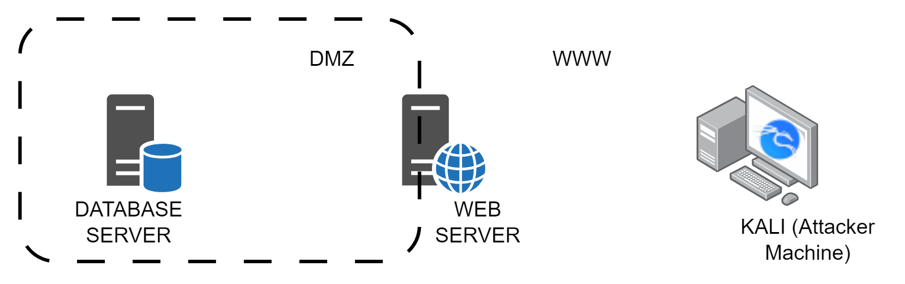

# Port Forwarding and Tunneling

<figure><figcaption><p>Infrastructure Setup</p></figcaption></figure>


### Socat

`Socat` is a general-purpose networking tool that can set up a simple port forward in a single command.

1. First, SSH/RDP into the web server (WEBSERVER01) as the webserver user.
2.  Use Socat to establish a port forward from WEBSERVER01 to DATABASE01's SSH service:

    ```bash
    webserver@webserver01:~$ socat TCP-LISTEN:2222,fork TCP:10.4.50.215:22
    ```

    This command sets up a port forwarding from local port 2222 on WEBSERVER01 to the SSH service (port 22) on DATABASE01 (IP: 10.4.50.215).
3.  Now, you can connect to the SSH service on DATABASE01 through the port forward using SSH from your local machine (kali).

    ```bash
    kali@kali:~$ ssh database_admin@192.168.50.63 -p 2222
    ```

    This SSH command connects to the SSH server on DATABASE01 through the port forward on WEBSERVER01 (using local port 2222).

Make sure to replace `database_admin` with the appropriate username for the SSH connection to DATABASE01 and `IP_Address` with the `WEBSERVER01_IP`.

***

### Proxychains

Proxychains is a powerful tool that facilitates routing network traffic from third-party applications through HTTP or SOCKS proxies. Below are improved instructions and explanations for each command:

1.  Edit the proxychains configuration file by running the following command:

    ```bash
    kali@kali:~$ sudo nano /etc/proxychains4.conf
    ```

    In the configuration file, you can add the proxies you want to use. By default, it's set to use the Tor network for anonymity. For example, to use a SOCKS5 proxy, you can add the following line under the `[ProxyList]` section:

    ```
    socks5 192.168.50.63 9999
    ```

    Replace `192.168.50.63` with the IP address of your SOCKS5 proxy server and `9999` with the corresponding port number.
2.  Use proxychains to run the `smbclient` command, forcing it to go through the configured proxy:

    
    ```
    kali@kali:~$ proxychains smbclient -L //172.16.50.217/ -U hr_admin --password=Welcome1234
    ```
    

    The `-L` option lists the available shares on the target host `172.16.50.217`. The `-U` option specifies the username `hr_admin`, and the `--password` option provides the corresponding password `Welcome1234`.
3.  Similarly, use proxychains to run the `nmap` command with additional options for a specific scan:

    ```
    kali@kali:~$ proxychains nmap -vvv -sT --top-ports=20 -Pn 172.16.50.217
    ```

    The `nmap` command uses the following options:

    * `-vvv`: Enables maximum verbosity to provide detailed output during the scan.
    * `-sT`: Performs a TCP connect scan, attempting to complete the three-way handshake with the target.
    * `-n`: Skips DNS resolution to speed up the scan by not attempting to resolve hostnames to IP addresses.
    * `-Pn`: Skips the host discovery stage, assuming the target host is up and actively filtering ports.
    * `172.16.50.217`: The target IP address to be scanned.
